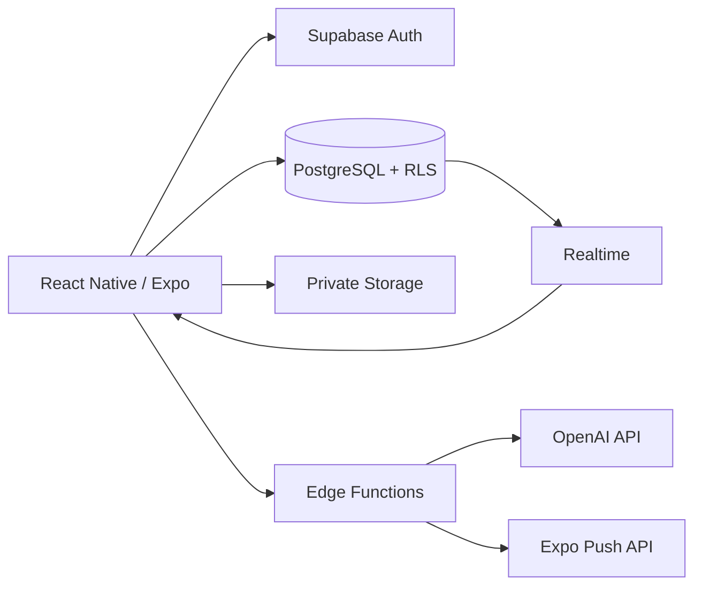

# Sevgilim Cepte 💕

[](https://github.com/feyzieskar/sevgilim-cepte/actions/workflows/ci.yml)


[English](#) | [Türkçe](README.tr.md)

> A private two-user iOS companion app built with React Native, Expo, TypeScript and Supabase.


Sevgilim Cepte brings together shared calendar management, photo memories with location tagging, mood tracking, daily photo streaks, a surprise box, and an AI-powered conversational assistant — all synchronized in real-time between two linked partners.

---

## ✨ Features

### 📅 Shared Calendar

- Shared events with category colors (date, trip, special day, work/school)
- Event reminders via local notifications
- Apple Calendar export
- Real-time sync between partners

### 📸 Memories

- Photo uploads with date, note, and location tagging
- Timeline view, favorites, and "On this day" feature
- Map view with pinned memories
- Reverse geocoding for location names

### 💬 Feyzi AI Assistant

- OpenAI GPT-4o powered conversational assistant
- Four modes: Normal, Moral Support, Date Planning, Memory Recall
- **Tool calling**: adds calendar events, special days, and love reasons
- User confirmation required before any write operation
- Chat history synced to cloud (personal, not shared with partner)

### 💕 Partner Experience

- Mood sharing and partner mood display
- Daily photo streak with consecutive-day counter
- Bucket list with categories and completion tracking
- Love reasons (50+ built-in + custom shared reasons)
- Surprise box with contextual unlock (date, mood, trip-based)
- Push notifications between partners

### 🛡️ Security

- All API secrets are server-side only (Supabase Edge Functions)
- OpenAI requests proxied through authenticated Edge Function
- Private media storage with signed URLs (no public access)
- Row Level Security on every database table
- Partner-only data access model
- Secure in-app partner pairing with time-limited codes

---

## 🏗️ Tech Stack

| Layer       | Technology                                            |
| ----------- | ----------------------------------------------------- |
| **Mobile**  | React Native, Expo SDK 54, TypeScript, Expo Router    |
| **Styling** | NativeWind (Tailwind CSS for RN)                      |
| **State**   | Zustand                                               |
| **Backend** | Supabase Auth, PostgreSQL, Realtime, Storage          |
| **Server**  | Supabase Edge Functions (Deno)                        |
| **AI**      | OpenAI GPT-4o (via server-side proxy)                 |
| **Native**  | Calendar, Notifications, Location, Image Picker, Maps |
| **CI**      | GitHub Actions, Jest, ESLint, TypeScript              |

---

## 🏛️ Architecture



See [docs/ARCHITECTURE.md](docs/ARCHITECTURE.md) for detailed architecture documentation.

---

## 🔒 Security

- **No API secrets in client bundle** — OpenAI and other service keys are stored exclusively in Supabase Edge Function environment variables
- **Server-side AI proxy** — All OpenAI requests go through an authenticated Edge Function with model hardcoding and input validation
- **Private media** — All storage buckets are private; access requires short-lived signed URLs
- **Row Level Security** — Every table enforces RLS with partner-only access via `linked_user_ids()`
- **Protected partner linking** — `partner_id` cannot be changed directly from the client
- **Service role isolation** — Service role key exists only in Edge Functions, never in client code

See [docs/SECURITY_ARCHITECTURE.md](docs/SECURITY_ARCHITECTURE.md) for the full security model.

---

## 🚀 Setup

### Prerequisites

- Node.js 20+
- Expo CLI (`npx expo`)
- Supabase project (free tier works)

### Client Setup

```bash
git clone https://github.com/feyzieskar/sevgilim-cepte.git
cd sevgilim-cepte
npm install
cp .env.example .env
# Fill in your Supabase URL and anon key in .env
npx expo start
```

### Server Secrets

API secrets are set as Supabase Edge Function environment variables — they are **never** added to the client `.env`:

```bash
supabase secrets set OPENAI_API_KEY=sk-...
```

### Database

Apply the schema via Supabase SQL Editor:

1. Run `migration.sql` (bootstrap schema)
2. Run files in `supabase/migrations/` (incremental changes)

---

## 📊 Project Status

| Feature            | Status         |
| ------------------ | -------------- |
| Core application   | ✅ Functional  |
| Supabase backend   | ✅ Implemented |
| Real-time sync     | ✅ Implemented |
| Push notifications | ✅ Implemented |
| AI text assistant  | ✅ Implemented |
| Partner pairing UI | ✅ Implemented |
| Voice/video AI     | 🔮 Planned     |

---

## 📖 Documentation

- [Architecture](docs/ARCHITECTURE.md) — System design, data flow, navigation
- [Security](docs/SECURITY_ARCHITECTURE.md) — Auth, RLS, storage, threat model
- [Portfolio Copy](docs/PORTFOLIO_COPY.md) — Ready-to-use project descriptions
- [Screenshot Checklist](docs/SCREENSHOT_CHECKLIST.md) — Guide for capturing app screenshots

---

## 🧪 Development

```bash
npm run lint          # ESLint
npm run typecheck     # TypeScript strict check
npm run test          # Jest unit tests
npm run format        # Prettier formatting
npm run check         # All checks combined
```

---

## 📄 License

This is a personal portfolio project. No license is currently specified. Default copyright applies.
