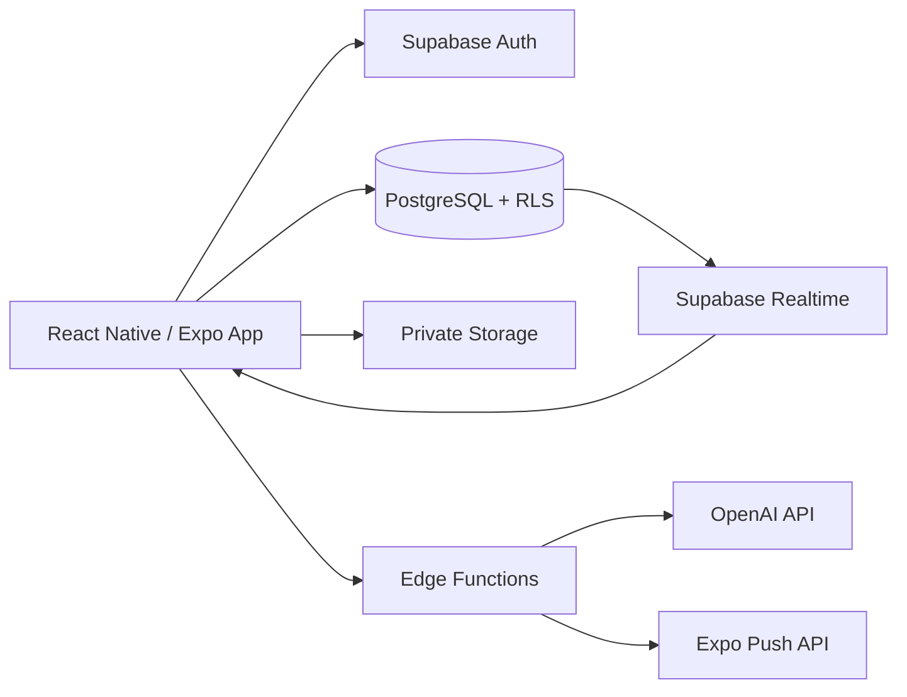
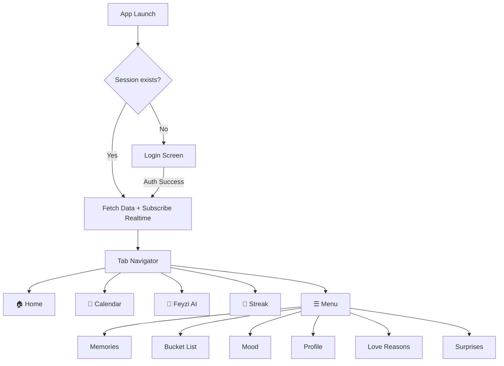
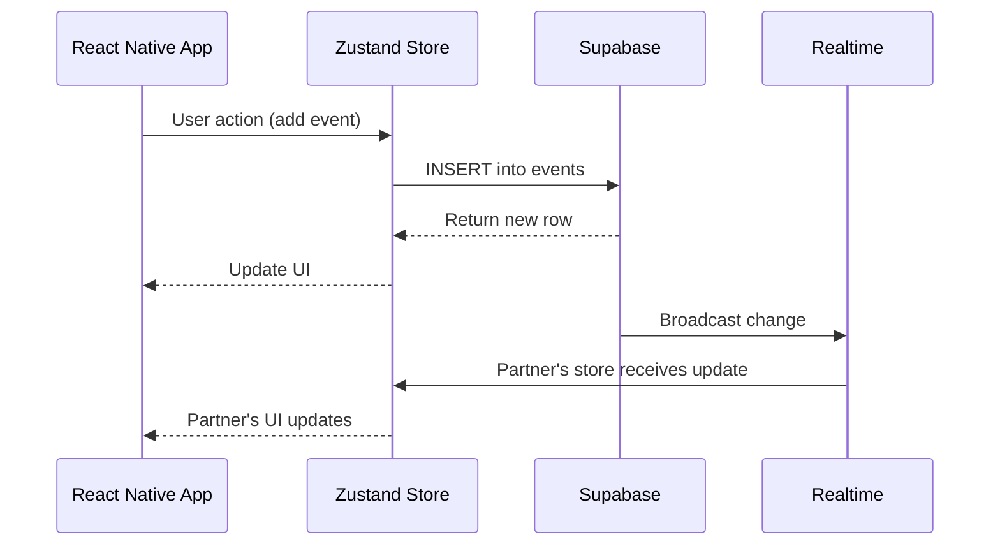
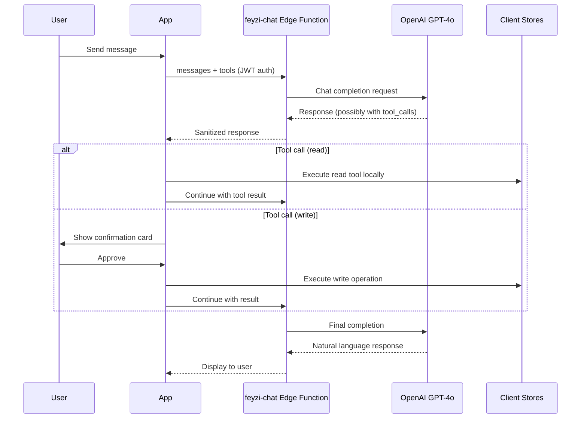
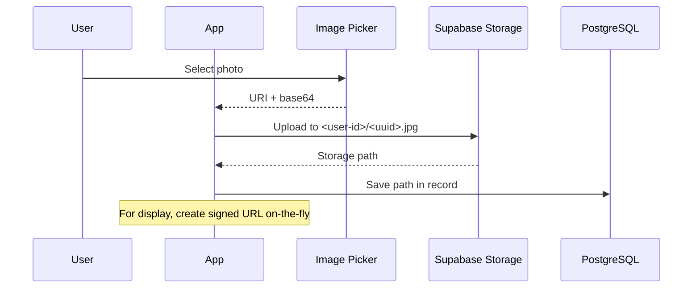

# Sevgilim Cepte — Architecture

## Overview

Sevgilim Cepte is a private two-user companion app built with React Native (Expo) and Supabase. The architecture is designed for real-time synchronization between two linked users (partners).

---

## System Architecture



---

## Folder Structure

```
sevgilim-cepte/
├── app/                        # Expo Router screens (file = route)
│   ├── _layout.tsx             # Root layout (auth guard, providers, bootstrap)
│   ├── (auth)/                 # Auth group (login/register)
│   │   └── login.tsx
│   ├── (tabs)/                 # Tab navigation (5 tabs)
│   │   ├── _layout.tsx         # Tab bar config + data bootstrap
│   │   ├── index.tsx           # 🏠 Home ("Bugün Biz")
│   │   ├── takvim.tsx          # 📅 Calendar
│   │   ├── feyzi-ai.tsx        # 💬 Feyzi AI
│   │   ├── streak.tsx          # 📸 Daily Streak
│   │   └── menu.tsx            # ☰ Menu (features grid)
│   ├── ani/[id].tsx            # Memory detail (dynamic route)
│   ├── anilar.tsx              # Memories list
│   ├── bucket-list.tsx         # Bucket list
│   ├── duygular.tsx            # Emotions
│   ├── profil.tsx              # Profile & settings
│   ├── ruh-hali.tsx            # Mood tracking
│   └── sevme-sebepleri.tsx     # Love reasons
├── components/                 # Reusable UI components
│   ├── bucket/                 # Bucket list components
│   ├── calendar/               # Calendar components
│   ├── cards/                  # Home screen cards
│   ├── chat/                   # Chat UI components
│   ├── emotion/                # Emotion components
│   ├── memory/                 # Memory components
│   ├── mood/                   # Mood components
│   ├── streak/                 # Streak components
│   ├── surprise/               # Surprise components
│   └── ui/                     # Shared UI primitives
├── store/                      # Zustand stores (13 stores)
├── services/                   # External service integrations
│   ├── feyziService.ts         # AI chat (via Edge Function)
│   ├── storageService.ts       # Photo upload/download
│   ├── pushService.ts          # Push notifications
│   ├── notifications.ts        # Local notifications
│   ├── media.ts                # Camera/gallery helpers
│   └── appleCalendar.ts        # Apple Calendar export
├── lib/                        # Core utilities
│   ├── supabase.ts             # Supabase client singleton
│   └── validation.ts           # Input validation helpers
├── constants/                  # App constants
│   ├── theme.ts                # Colors, gradients, shadows
│   ├── tarih.ts                # Turkish date formatters
│   ├── kategoriler.ts          # Event categories
│   ├── feyziPrompts.ts         # AI system prompts
│   ├── gunlukSecim.ts          # Daily selection helpers
│   └── surpriz.ts              # Surprise type helpers
├── data/                       # Static data & helpers
├── supabase/                   # Supabase configuration
│   ├── functions/              # Edge Functions
│   │   ├── feyzi-chat/         # OpenAI proxy
│   │   └── send-push/          # Push notification sender
│   └── migrations/             # Incremental SQL migrations
├── __tests__/                  # Unit tests
├── docs/                       # Documentation
└── migration.sql               # Legacy bootstrap schema
```

---

## Navigation Flow



---

## State Management

Zustand stores with Supabase persistence:

| Store           | Scope                   | Realtime |
| --------------- | ----------------------- | -------- |
| authStore       | Session, user           | —        |
| profileStore    | User + partner profiles | —        |
| calendarStore   | Shared events           | ✅       |
| memoryStore     | Shared memories         | —        |
| surpriseStore   | Shared surprises        | ✅       |
| loveReasonStore | Shared love reasons     | ✅       |
| ozelGunStore    | Shared special days     | ✅       |
| chatStore       | Personal chat history   | —        |
| emotionStore    | Shared emotions         | ✅       |
| streakStore     | Photos + streak counter | ✅       |
| moodStore       | Shared moods            | ✅       |
| bucketListStore | Shared bucket list      | ✅       |
| useThemeStore   | Theme preference        | Local    |

---

## Data Flow



---

## AI Assistant Flow



---

## Media Upload Flow


