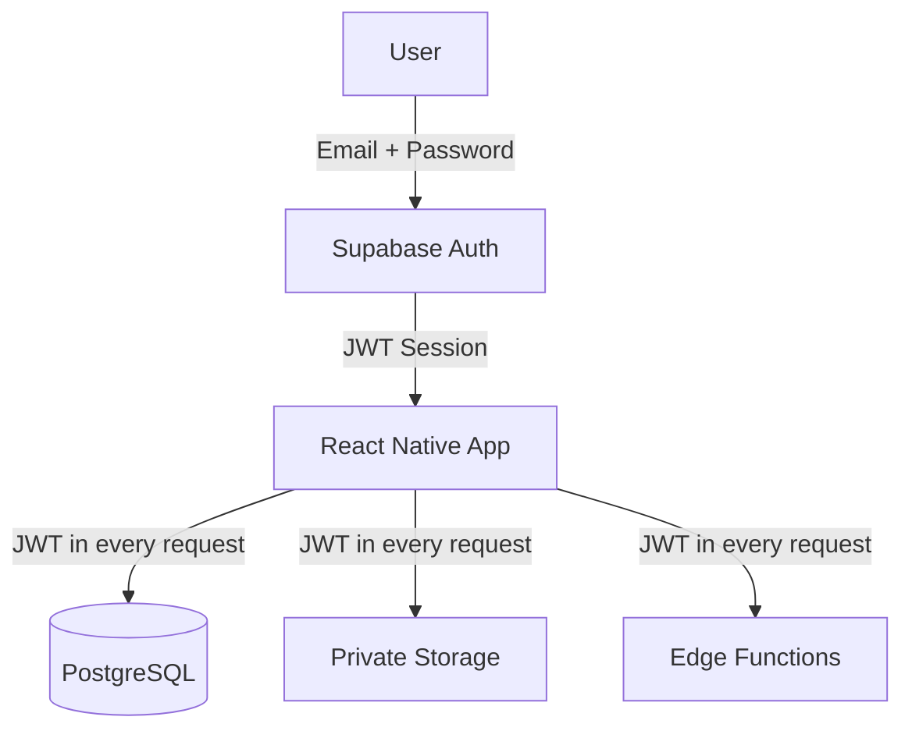
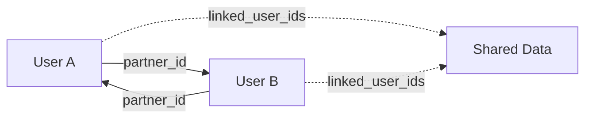
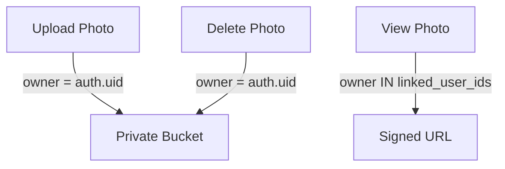
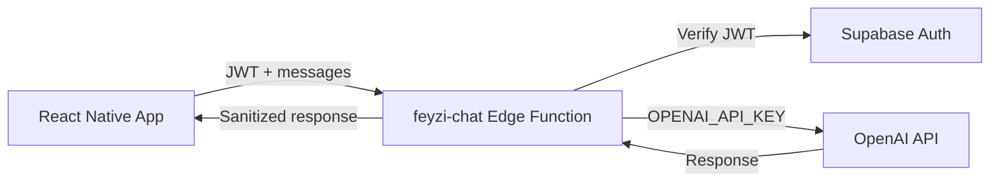

# Sevgilim Cepte — Security Architecture

> This document describes the security model of the Sevgilim Cepte application.

---

## Authentication

- Email/password authentication via Supabase Auth
- Sessions persisted in AsyncStorage (auto-refresh)
- JWT tokens attached to all Supabase requests
- Access tokens refreshed automatically via `onAuthStateChange`

---

## Partner Relationship Model

- Two users linked via `profiles.partner_id` (reciprocal)
- `linked_user_ids()` SQL function returns `{self, partner}`
- All shared table RLS policies use `created_by IN (SELECT linked_user_ids())`
- `partner_id` cannot be changed directly by the client (protected by trigger)
- Pairing requires a time-limited, hashed, one-time code

---

## Row Level Security (RLS)

Every table has RLS enabled. Policy strategy:

| Table          | SELECT              | INSERT | UPDATE                   | DELETE |
| -------------- | ------------------- | ------ | ------------------------ | ------ |
| profiles       | self + partner      | self   | self (safe columns only) | —      |
| events         | linked              | self   | linked                   | linked |
| memories       | linked              | self   | linked                   | linked |
| surprises      | linked              | self   | linked                   | linked |
| love_reasons   | linked              | self   | linked                   | linked |
| special_days   | linked              | self   | linked                   | linked |
| chat_messages  | self only           | self   | —                        | self   |
| emotion_events | linked              | self   | linked                   | linked |
| streak_photos  | linked              | self   | —                        | self   |
| streaks        | linked (couple_key) | self   | linked                   | —      |
| moods          | linked              | self   | self                     | self   |
| bucket_list    | linked              | self   | linked                   | linked |
| pairing_codes  | self                | self   | —                        | —      |

**"linked"** = `created_by IN (SELECT public.linked_user_ids())`

---

## Storage Permissions

- All media buckets are **private** (`public = false`)
- Files stored as `<user-id>/<uuid>.jpg`
- Access requires signed URLs (1-hour expiry)
- No permanent public URLs stored in the database
- Upload: authenticated user, owner = self
- View: owner must be self or partner
- Delete: only the original uploader

---

## Edge Functions

### feyzi-chat (OpenAI Proxy)

- JWT authentication required
- `OPENAI_API_KEY` read from `Deno.env.get()` (server secret)
- API key never returned to client or logged
- Model hardcoded to `gpt-4o` (client cannot override)
- `max_tokens` capped server-side
- Request body validated (message count, payload size)
- Error messages sanitized (no key/internal info)

### send-push (Push Notifications)

- JWT authentication required
- Partner verification (caller can only notify their partner)
- Push token read via service_role (RLS bypass)
- Input validation: title (100 chars), body (500 chars), data (1KB)

---

## Secret Management

| Secret                      | Location                   | Access                  |
| --------------------------- | -------------------------- | ----------------------- |
| `OPENAI_API_KEY`            | Supabase Edge Function env | Server only             |
| `SUPABASE_SERVICE_ROLE_KEY` | Supabase Edge Function env | Server only             |
| `SUPABASE_ANON_KEY`         | Client `.env` / app bundle | Public (safe by design) |
| `SUPABASE_URL`              | Client `.env` / app bundle | Public                  |
| `EAS_PROJECT_ID`            | Client `.env` / app bundle | Public                  |

> **Third-party service secrets (OpenAI, ElevenLabs, D-ID) are never bundled into the mobile application.**

---

## Threat Model Summary

| Threat                             | Mitigation                                         |
| ---------------------------------- | -------------------------------------------------- |
| API key extraction from app bundle | Keys are server-side only (Edge Functions)         |
| Unauthorized data access           | RLS on every table + partner-only access           |
| Public media exposure              | Private buckets + signed URLs                      |
| Partner spoofing                   | partner_id protected by trigger; pairing via codes |
| Push notification abuse            | Partner verification in Edge Function              |
| Arbitrary model/endpoint selection | Model hardcoded server-side                        |
| Large payload attacks              | Request body size limits in Edge Functions         |
| Secret in git history              | `.env` in gitignore; manual key rotation advised   |
